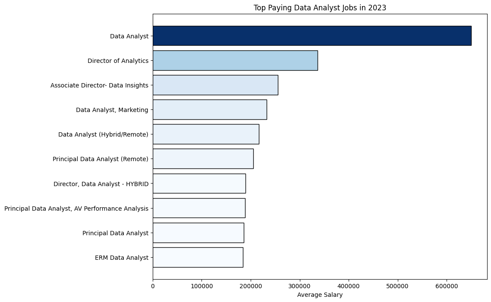
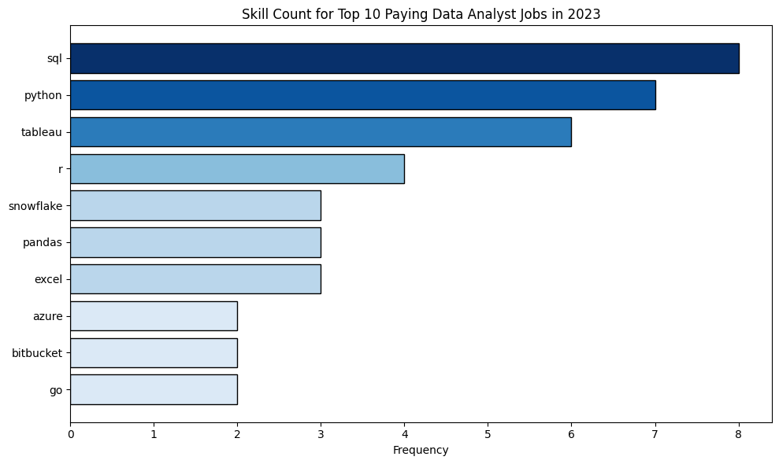

# 2023 Data Job Analysis
This project explores the 2023 data job market, **focusing on data analyst roles**. It reviews top-paying positions, essential in-demand skills, and where high demand intersects with high salaries in data analytics. Additionally, the repository showcases various techniques and queries for proficiently managing and manipulating data within PostgreSQL databases.

## Tools and Technologies
- **SQL:** The primary language used for data manipulation and analysis.
- **PostgreSQL:** The database management system used for running SQL queries.
- **pgAdmin:** A tool for managing PostgreSQL databases and running queries.
- **Git:** Version control system for managing project changes.
- **GitHub:** Platform for hosting and sharing the project repository.

## The Analysis
### 1. Top Paying Data Analyst Jobs
```sql
SELECT
    job_id,
    job_title,
    name AS company_name,
    job_location,
    job_schedule_type,
    salary_year_avg,
    job_posted_date
FROM
    job_postings_fact a
LEFT JOIN company_dim b ON a.company_id = b.company_id
WHERE
    job_title_short = 'Data Analyst'
    AND job_location = 'Anywhere'
    AND salary_year_avg IS NOT NULL
ORDER BY
    salary_year_avg DESC
LIMIT 10
```


*Visuaization using Python*

**Insights:**
- **Advanced Skill Requirements:** Top-paying data analyst roles require a mix of advanced skills and considerable experience.
- **High-Paying Positions:** Roles such as `Data Scientist`, `Senior Data Analyst`, and `Analytics Manager` stand out for their high earning potential, reflecting the increasing value placed on advanced analytical skills and leadership in data-driven decision-making.

### 2. Skills for Top Paying Data Analyst Jobs
```sql
WITH top_paying_job AS (
    SELECT
        job_id,
        job_title,
        salary_year_avg,
        name AS company_name
    FROM
        job_postings_fact a
    LEFT JOIN company_dim b ON a.company_id = b.company_id
    WHERE
        job_title_short = 'Data Analyst'
        AND job_location = 'Anywhere'
        AND salary_year_avg IS NOT NULL
    ORDER BY
        salary_year_avg DESC
    LIMIT 10    
)
SELECT 
    c.*,
    skills
FROM top_paying_job c
INNER JOIN skills_job_dim d ON c.job_id = d.job_id
INNER JOIN skills_dim e ON d.skill_id = e.skill_id 
ORDER BY
    salary_year_avg DESC
```

*Visuaization using Python*

**Insights:**
- **High-Paying Skills:** The chart emphasizes skills most commonly linked to high-paying data analyst roles.
- **Crucial Skills:** Advanced `SQL`, machine learning expertise, and proficiency in data visualization tools (e.g., `Tableau`, `Power BI`) are vital for securing top-paying positions.
- **Specialized Knowledge:** Skills in cloud computing (`AWS`, `Azure`) and statistical analysis are highly valued and contribute significantly to higher salaries.

### 3. In-Demand Skills for Data Analyst
```sql
SELECT 
    skills,
    COUNT(b.job_id) AS demand_count
FROM 
    job_postings_fact a
INNER JOIN 
    skills_job_dim b ON a.job_id = b.job_id
INNER JOIN 
    skills_dim c ON b.skill_id = c.skill_id 
WHERE
    job_title_short = 'Data Analyst'
    AND job_work_from_home = TRUE
GROUP BY
    skills
ORDER BY 
    demand_count DESC
LIMIT 5
```

| Skill     | Demand Count |
|-----------|--------------|
| SQL       | 7,291        |
| Excel     | 4,611        |
| Python    | 4,330        |
| Tableau   | 3,745        |
| Power BI  | 2,609        |

**Insights:**
- **SQL Dominance:** `SQL` continues to be the most in-demand skill, highlighting its essential role in data manipulation and querying across diverse industries.
- **Excel’s Enduring Importance:** `Excel` remains a key tool for data analysis, particularly in financial and administrative contexts.
- **Growing Python Popularity:** `Python` is increasingly valued for its versatility and use in data science and machine learning.
- **Top Visualization Tools:** `Tableau` and `Power BI` are highly sought after for their powerful data visualization capabilities, crucial for effective reporting and decision-making.

### 4. Highest Earning Skills for Data Analyst
```sql
SELECT 
    skills,
    ROUND(AVG(salary_year_avg), 0) AS salary_avg
FROM 
    job_postings_fact a
INNER JOIN 
    skills_job_dim b ON a.job_id = b.job_id
INNER JOIN 
    skills_dim c ON b.skill_id = c.skill_id 
WHERE
    job_title_short = 'Data Analyst'
    AND salary_year_avg IS NOT NULL
    AND job_work_from_home = TRUE
GROUP BY
    skills
ORDER BY 
    salary_avg DESC
LIMIT 25
```

|Skill          | Average Salary ($) |
|---------------|--------------------|
|PySpark        | 208,172            |
|Bitbucket	    | 189,155            |
|Couchbase	    | 160,515            |
|Watson	        | 160,515            |
|DataRobot	    | 155,486            |
|GitLab	        | 154,500            |
|Swift	        | 153,750            |
|Jupyter	    | 152,777            |
|Pandas	        | 151,821            |
|Elasticsearch  | 145,000            |

**Insights:**
- **Big Data and Advanced Analytics:** Skills in `PySpark`, `DataRobot`, and `Databricks` are crucial for handling big data, leveraging advanced machine learning platforms, and performing unified analytics.
- **DevOps and Automation:** Proficiency in `Bitbucket`, `Jenkins`, and `Kubernetes` underscores the significance of collaboration, version control, automated deployment, and managing scalable containerized applications.
- **Core Programming and Data Science Libraries:** Expertise in `Pandas`, `Numpy`, and `Scikit-learn` is essential for data manipulation, numerical computing, and machine learning, forming the foundation of data science.

### 5. Most Effective Skills for Career Growth
```sql
SELECT
    c.skills,
    COUNT(a.job_id) AS demand_count,
    ROUND(AVG(salary_year_avg), 0) AS salary_avg
FROM job_postings_fact a
INNER JOIN skills_job_dim b ON a.job_id = b.job_id
INNER JOIN skills_dim c ON b.skill_id = c.skill_id 
WHERE
    job_title_short = 'Data Analyst'
    AND salary_year_avg IS NOT NULL
    AND job_work_from_home = TRUE
GROUP BY c.skill_id
HAVING COUNT(a.job_id) > 10
ORDER BY
    salary_avg DESC,
    demand_count DESC 
LIMIT 25
```

|Skill	    | Demand Count | Average Salary ($)|
|-----------|--------------|-------------------|
|Go	        | 27	       | 115,320           |    
|Confluence | 11	       | 114,210           |    
|Hadoop	    | 22	       | 113,193           |    
|Snowflake	| 37	       | 112,948           |    
|Azure	    | 34	       | 111,225           |    
|BigQuery	| 13	       | 109,654           |    
|AWS	    | 32	       | 108,317           |    
|Java	    | 17	       | 106,906           |    
|SSIS	    | 12	       | 106,683           |    
|Jira	    | 20	       | 104,918           |

**Insights:**
- **Top Paying Skill:** `Go` offers the highest average salary at $115,320, indicating its strong value in the data analyst job market.
- **High Value Cloud Technologies:** Skills in `Azure`, `Snowflake`, and `AWS` are among the highest paying, reflecting the premium on cloud expertise.
- **Competitive Data Tools:** Proficiency in tools like `Hadoop` and `BigQuery` also leads to substantial salaries, highlighting their importance in data management.

## Conclusion
Merged conclusion from the analysis insights:
- **Top Paying Data Analyst Jobs:** High-paying data analyst roles like Data Scientist and Analytics Manager require advanced skills and experience.
- **Skills for Top Paying Data Analyst Jobs:** Advanced SQL, machine learning, and data visualization skills are key for high-paying data analyst positions.
- **In-Demand Skills for Data Analyst:** SQL is the most sought-after skill, with Excel and Python also important, and Tableau and Power BI are valued for data visualization.
- **Highest Earning Skills for Data Analyst:** Skills in big data tools (e.g., PySpark) and advanced analytics (e.g., DataRobot) lead to the highest salaries.
- **Most Effective Skills for Career Growth:** Skills in Go, Azure, and Snowflake offer the highest salaries and are crucial for career advancement in data analysis.

## Acknowledgements
Special thanks to Luke Barousse for the data insights provided in [his YouTube video](https://youtu.be/7mz73uXD9DA?si=TJWDsG3Eb68o0hoJ). 